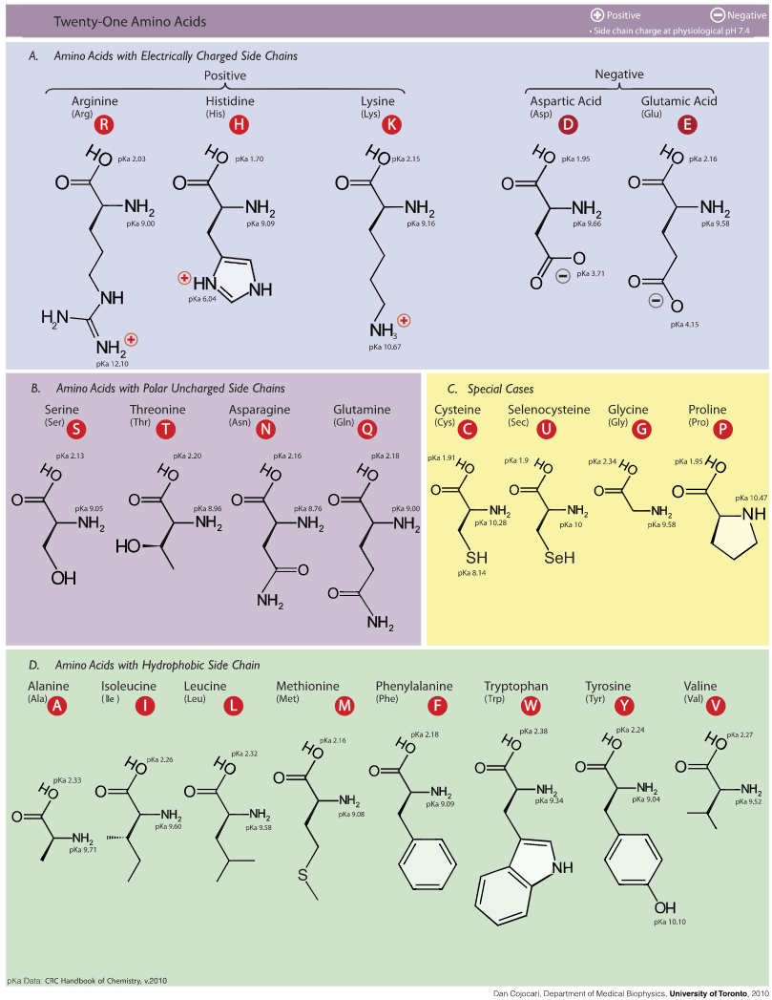
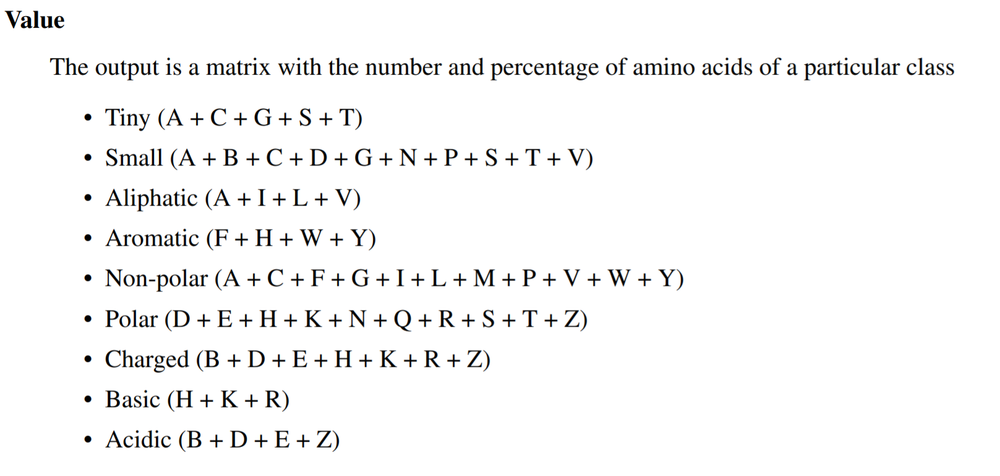

```{r,echo=FALSE}
# COLORES 
colores1 <- c(rgb(219/255,84/255,97/255,alpha = 1),
              rgb(255/255,200/255,87/255,alpha = 1),
              rgb(87/255,204/255,153/255,alpha = 1),
              rgb(56/255,163/255,165/255,alpha = 1),
              rgb(98/255,76/255,171/255,alpha = 1)
              )

colores2 <- c(rgb(219/255,84/255,97/255,alpha = .5),
              rgb(255/255,200/255,87/255,alpha = .5),
              rgb(87/255,204/255,153/255,alpha = .5),
              rgb(56/255,163/255,165/255,alpha = .5),
              rgb(98/255,76/255,171/255,alpha = .5)
              )

```

# Introducción
Las secuencias son fundamentales en la bioinformática. Nosotros trabajamos con secuenicas desde el inicio de la disciplina, algo más de 50 años. 
Las estruccturas biológicas como proteínas y nucleótidos están representados usualmente como cadena de caractres. Estas cadenas de caracteres están almacenadas y accesibles desde repositorios en linea.
# Previo
Nuestro proyecto de R tiene cuatro carpetas principales:
1. **scr**: donde están todos nuestros scripts de R.
2. **data**: donde están todos nuestros datos.
3. **graphic**: donde están todos los gráficos que se generan.
4. **result**: donde están todos los resultados de los análisis.
# Importación de una secuencia desde una secuencia de una base de datos remota
Primero necesitamos cargar los paquetes que vamos a utilizar:

```{r}
library(seqinr)
library(ape)
```
Una vez instalado el paquete seqinr vamos a utilizar la función **read.fasta()** y en el parámetro de dirección vamos a poner la localizaición del archivo fasta que previamente descargamos de la vase de datos Uniprot (https://www.uniprot.org/) del Instituto Europeo Bioinformático (https://www.ebi.ac.uk/). Esta secuencia corresponde a la proteína spike de virus SARS-CoV-2 (https://www.uniprot.org/uniprot/P0DTC2), que en la base de NCBI corresponde a la siguiente proteína: https://www.ncbi.nlm.nih.gov/protein/YP_009724390.1).
Creamos un objeto **"ruta"** para almacenar de forma mas sencilla la direccion de nuestro archivo.
```{r}
ruta <- paste0(getwd(), .Platform$file.sep, "data", .Platform$file.sep, "spike.fasta")
```
La función **getwd()** nos devuelve la dirección actual del archivo de trabajo. La función **paste0()** crea una cadena de caractares pegando todos los parámetro sin ninguna separación. La función **.Platform$file.sep()** hace referencia al tipo de separador del sistema operativo que estemos utilizando. Esto es de gran ayuda si vamos a correr nuestro programa en diferentes sistemas operativos, ya que cada uno de ellos tiene diferentes separadores. Si nosotros usamos la función **print()** vemos que ruta hace referencia exacta a la ubicación de nuestro archivo.
```{r}
print(ruta)
```
Ahora que ya tenemos la ruta podemos crear el objeto con la función **read.fasta()** del paquete **seqinr**. Llamaremos al objeto **"spike"**

```{r}
spike <- seqinr::read.fasta(file = paste0(getwd(),.Platform$file.sep, "data",.Platform$file.sep,"spike.txt"), 
                            seqtype = "AA")

```
Ahora que ya tenemos la secuencia cargada, podemos imprimir la secuencia en pantalla con la función *getSequence()* del paquete *seqinr*:

```{r}
seqinr::getSequence(spike)

```
Visualizar uno a uno de los aminoácidos de la secucencia es poco cómodo. Sería mas util si viéramos una tabla de contingencia con la frecuencia absoluta de cada amiácido. Para ello podemos usar la función nativa de R **table()** para generar facilmente una tabla de contingencia.
```{r}
p1 <- table(seqinr::getSequence(spike))
print(p1)
```
Como vemos los aminoácidos están representados por una letra, una forma de codificación IUPAC universal. Pueden tomar la siguiente tabla como referencia.
<center>
## AMINOÁCIDOS
</center>


Sin embargo, aún no es tan facil distinguir cuales son los aminoácidos mas frecuentes. Para ello podriamos hacer una gráfica de barras que permitiría identificar rapidamente los aminoácidos más frecuentes y menos frecuentes. Para ello usaremos la función nativa de R: **barplot()** sobre el objeto **p1** que creamos previamente.

```{r}
barplot(p1, las = 1, main = "Frecuencia absoluta de AA", ylab = "frecuencia absoluta", xlab = "aminoacido", col = colores1)
```
Tal vez sería mas conveniente verlos ordenados de mayor a menor por su frecuencia relativa. Para ello tendremos que dividir los valores previos entre el número total de aminoácidos de la secuencia. Para ello usaremos la función **length()**.
```{r}
long <- length(unlist(seqinr::getSequence(spike)))
long
```

Vemos que la longitud de la secuencia es de 1273 aminoácidos. Si dividmos el objeto **p1** entre la longitud **long**, y lo ordenamos con la función **sort()**, podremos ver un gráfico mas util.

```{r}
barplot(sort(p1/long, decreasing = T), las = 1, main = "Frecuencia absoluta de AA", ylab = "frecuencia absoluta", xlab = "aminoacido", col = colores1)

```
Vemos que los aminoácidos mas frecuentes son Lisina (un aminoácido hidrofóbico), Serina y Treonina (aminoácidos polares sin carga)

# Estadística descriptiva de proteínas
El paquete **seqinr** nos permite obtener con una sola función la estadística descriptiva de la proteína. Esta función es **AAsata()**, y nos brinda los valores de punto Isoelectrico, hidrofobicidad entre otros. Además nos da una gráfica de toda la secuencia.
```{r}
secuencia <- seqinr::getSequence(spike)
seqinr::AAstat(unlist(secuencia))
```
A continuanción les muestro una referencia rápida de los terminos usados en esta función.

<center>
## Grupos de aminoácidos
</center>

```{r}


```

